# Architecture — ub-exchange-cli-main

This document describes the actual architecture of the Go exchange service: package layering rules,
key data flows, DI service dependency graph, Redis data structures, RabbitMQ topology, and Centrifugo
topic structure. Every claim is traceable to a specific source file.

---

## Table of Contents

1. [Package Dependency Layers](#1-package-dependency-layers)
2. [Key Data Flows](#2-key-data-flows)
   - [Order Creation Flow](#21-order-creation-flow)
   - [Order Matching Flow](#22-order-matching-flow)
   - [Trade Settlement Flow](#23-trade-settlement-flow)
   - [Withdrawal Flow](#24-withdrawal-flow)
   - [Real-time Market Data Flow (Binance WS)](#25-real-time-market-data-flow-binance-ws)
3. [DI Service Dependency Graph](#3-di-service-dependency-graph)
4. [Redis Data Structures](#4-redis-data-structures)
5. [RabbitMQ Queue Topology](#5-rabbitmq-queue-topology)
6. [Centrifugo Channel Structure](#6-centrifugo-channel-structure)
7. [Binary Entry Points](#7-binary-entry-points)

---

## 1. Package Dependency Layers

Dependency flow is strictly top-down. Lower layers must never import upper layers.

```
┌─────────────────────────────────────────────────────────────────────┐
│  cmd/                                                                │
│  exchange-cli · exchange-engine · exchange-httpd · exchange-ws       │
│  Entry points only: wire DI container, start goroutines              │
└────────────────────────────┬────────────────────────────────────────┘
                             │ imports
┌────────────────────────────▼────────────────────────────────────────┐
│  internal/api/                                                       │
│  handler/ · adminhandler/ · middleware/ · httpserver.go · routes.go  │
│  Gin HTTP server, routing, JWT middleware                            │
└──────────────┬──────────────────────────────────┬───────────────────┘
               │ imports                          │ imports
┌──────────────▼──────────────┐   ┌──────────────▼───────────────────┐
│  internal/engine/           │   │  Domain services                  │
│  Order matching worker pool │   │  auth · order · payment · user    │
│  Redis sorted set orderbook │   │  currency · userbalance · wallet  │
│  Queue dispatcher (BLPop)   │   │  configuration · country          │
└──────────────┬──────────────┘   │  orderbook · livedata             │
               │                  │  externalexchange · transaction   │
               │                  └──────────────┬────────────────────┘
               │                                 │ imports
               │                  ┌──────────────▼────────────────────┐
               │                  │  internal/repository/             │
               │                  │  26 GORM repositories             │
               │                  │  One per entity, pure data access  │
               └──────────────────┴──────────────┬────────────────────┘
                                                 │ imports
                                  ┌──────────────▼────────────────────┐
                                  │  internal/platform/               │
                                  │  Infrastructure abstractions:     │
                                  │  Configs · Logger · RedisClient   │
                                  │  RabbitMqClient · CentrifugoClient      │
                                  │  JwtHandler · PasswordEncoder     │
                                  │  HTTPClient · WsClient · Cache    │
                                  │  SqlClient (GORM *gorm.DB)        │
                                  └──────────────┬────────────────────┘
                                                 │ connects to
                                  ┌──────────────▼────────────────────┐
                                  │  External Systems                  │
                                  │  MySQL/MariaDB · Redis · RabbitMQ │
                                  │  Centrifugo · Binance WS/REST API  │
                                  │  External wallet service (HTTP)    │
                                  └───────────────────────────────────┘
```

**Cross-cutting packages** (imported by any layer):

| Package | Role |
|---------|------|
| `internal/communication` | Centrifugo publishing (`CentrifugoManager`) + RabbitMQ publishing (`QueueManager`) |
| `internal/processor` | Transforms Binance WS events → livedata + Centrifugo |
| `internal/di` | Wires all ~115 services into a single `sarulabs/di` App-scoped container |
| `internal/jwt` | JWT token creation/validation helpers |
| `internal/response` | Standard `{status, message, data}` API response struct |

---

## 2. Key Data Flows

### 2.1 Order Creation Flow

**Source files:** `internal/api/handler/`, `internal/order/` (orderservice, ordercreatemanager, ordereventshandler), `internal/engine/`

```
Client HTTP POST /api/v1/orders
        │
        ▼
[Gin router] → middleware.AuthMiddleware validates JWT
        │
        ▼
handler.CreateOrder()
  └─ calls OrderService.Create()
              │
              ▼
        OrderCreateManager.Create()
          ├─ DB: persist new order record (GORM)
          ├─ UserBalanceService.LockBalance()    ← freeze user funds
          └─ returns saved order
              │
              ▼
        OrderEventsHandler.OnOrderCreated()
          ├─ DecisionManager.Decide()            ← "internal" vs "external"?
          │    │
          │    ├─ INTERNAL path:
          │    │    EngineCommunicator.SubmitToEngine()
          │    │      └─ Engine.SubmitOrder()
          │    │           └─ Redis RPUSH  "engine:queue:orders"  (JSON)
          │    │
          │    └─ EXTERNAL path:
          │         ExternalExchangeOrderService.Submit()
          │           └─ Binance REST API POST /order
          │
          └─ CentrifugoManager.PublishOrderToOpenOrders()
               └─ Centrifugo channel: trade:user:<privateChannel>:open-orders
```

**Key facts:**
- `DecisionManager` is configured from `config.yaml` (`order.decision`) — source: `internal/order/decisionmanager.go`
- The engine queue key is the constant `engine:queue:orders` (source: `internal/engine/queue.go` line 11)
- All monetary operations use `shopspring/decimal` — never `float64`

---

### 2.2 Order Matching Flow

**Source files:** `cmd/exchange-engine/main.go`, `internal/engine/engine.go`, `internal/engine/worker.go`, `internal/engine/orderbook.go`, `internal/engine/redisorderbookprovider.go`

```
exchange-engine binary starts
  └─ engine.Run(workerCount=10, shouldStartDispatcher=true)
        │
        ▼
  Dispatcher goroutine: BLPop("engine:queue:orders", 1s timeout)
        │  (blocks until an order arrives)
        ▼
  work{order} → pool.addWork(&work)  →  worker.workChan
        │
        ▼
  worker.processOrder(o)
    └─ ob := newOrderBook(o.Pair, redisOrderBookProvider)
         │
         ├─ ob.loadOrders(oppositeSide)
         │    └─ Redis ZRangeByScoreWithScores("order-book:bid:<pair>" or "order-book:ask:<pair>")
         │
         ├─ price-time matching loop  (processLimitOrder / processMarketOrder)
         │    └─ tradeOrders() → builds doneOrders[], partialOrder
         │
         └─ callBackManager.callBack(doneOrders, partialOrder)
              └─ EngineResultHandler.CallBack()
                   └─ PostOrderMatchingService.Handle()  [see §2.3]
                        │
                        └─ ob.rewriteOrderBook(removingDoneOrders, remainingPartial)
                             └─ Redis TxPipeline:
                                  ZRem done orders from sorted set
                                  ZAdd partial fill back into sorted set
```

**Sorted set score = price as float64.** Bid book: `ZPopMax` (highest price first). Ask book: `ZPopMin` (lowest price first). Source: `internal/engine/redisorderbookprovider.go`.

**Recovery path:** `engine.RetrieveOrder()` does `LPush` (head of queue) to give priority to orders that fell out of Redis unexpectedly.

---

### 2.3 Trade Settlement Flow

**Source files:** `internal/order/postordermatchingservice.go`, `internal/userbalance/`, `internal/livedata/`

```
PostOrderMatchingService.Handle(doneOrders, partialOrder)
  │
  ├─ 1. DB transaction: persist trade records (GORM)
  │       OrderRepository.UpdateStatus(FILLED / PARTIAL)
  │
  ├─ 2. UserBalanceService.UpdateBalances()
  │       ├─ debit seller base currency
  │       ├─ credit seller quote currency
  │       ├─ debit buyer quote currency
  │       └─ credit buyer base currency
  │       (all inside a single DB transaction)
  │
  ├─ 3. TradeEventsHandler.OnTrade()
  │       └─ BotAggregationService.Aggregate()
  │            └─ Redis: accumulates bot trade data for submit-bot-orders command
  │
  ├─ 4. LiveDataService.UpdateTradeBook()
  │       └─ Redis HSET  live_data:pair_currency:<pair>  trade_book <last 20 trades>
  │
  ├─ 5. CentrifugoManager.PublishTrades()
  │       └─ Centrifugo channel: trade:trade-book:<pair>
  │
  └─ 6. CentrifugoManager.PublishOrderToOpenOrders()  (per involved user)
          └─ Centrifugo channel: trade:user:<privateChannel>:open-orders
```

**Result returned to engine:** `MatchingResult{RemovingDoneOrderIds, RemainingPartialOrder}` — engine uses this to atomically rewrite the Redis sorted sets.

---

### 2.4 Withdrawal Flow

**Source files:** `internal/api/handler/`, `internal/payment/paymentservice.go`, `internal/wallet/`, `internal/communication/`

```
Client HTTP POST /api/v1/payments/withdraw
        │
        ▼
handler.CreateWithdraw()
  └─ PaymentService.CreateWithdrawal()
        │
        ├─ 1. PermissionManager.CheckWithdrawPermission()
        │
        ├─ 2. UserConfigService.Get2FAConfig()  +  TwoFaManager.Verify()
        │
        ├─ 3. WithdrawEmailConfirmationManager.SendCode()
        │       └─ Redis SET  withdraw:confirm:<userId>  <code>  TTL
        │       └─ CommunicationService.SendWithdrawConfirmationEmail()
        │            └─ QueueManager.PublishEmailOrSms()
        │                 └─ RabbitMQ  routing key: "messages.command.send"
        │
        │  [User submits email confirmation code via separate endpoint]
        │
        ├─ 4. WithdrawEmailConfirmationManager.Verify(code)
        │       └─ Redis GET + DEL
        │
        ├─ 5. UserBalanceService.LockBalance()  (DB)
        │
        ├─ 6. WalletService.CreateWithdrawal()
        │       └─ wallet.AuthorizationService.GetToken()
        │            └─ Redis GET  wallet:auth:<token>  (cached JWT)
        │            └─ HTTP POST to external wallet service API
        │
        ├─ 7. PaymentRepository.Create()  (DB)
        │
        └─ 8. CentrifugoManager.PublishPayment()
                └─ Centrifugo channel: trade:user:<privateChannel>:crypto-payments
```

**Polling completion:** `check-withdrawals` CLI command (runs every 10 min) calls `ExternalExchangeService.CheckWithdrawals()` → updates payment status → `CommunicationService.SendCryptoPaymentStatusUpdateEmail()`.

---

### 2.5 Real-time Market Data Flow (Binance WS)

**Source files:** `cmd/exchange-ws/main.go`, `internal/externalexchangews/`, `internal/processor/dataprocessor.go`, `internal/livedata/service.go`, `internal/communication/centrifugomanager.go`

```
exchange-ws binary
  └─ ExternalExchangeWsService.GetActiveExternalExchangeWs()
       └─ binance.WsClient.Run(ctx, streams)    ← Binance WebSocket
            │  (streams default: DepthStream)
            ▼
       Incoming frame → WsDataProcessor (Processor interface)
            │
            ├─ ProcessTrade(trade)
            │    ├─ LiveDataService.UpdateTradeBook()
            │    │    └─ Redis HSET  live_data:pair_currency:<pair>  trade_book
            │    └─ CentrifugoManager.PublishTrades()
            │         └─ Centrifugo: trade:trade-book:<pair>
            │
            ├─ ProcessDepth(depth)
            │    ├─ LiveDataService.SetDepthSnapshot()
            │    │    └─ Redis HSET  live_data:pair_currency:<pair>  depth_snapshot
            │    └─ CentrifugoManager.PublishOrderBook()
            │         └─ Centrifugo: trade:order-book:<pair>
            │
            ├─ ProcessKline(kline)
            │    ├─ KlineService.SaveKline()  (rotates current → pre-kline in Redis)
            │    │    └─ Redis HSET  live_data:pair_currency:<pair>  kline_<tf>  pre_kline_<tf>
            │    ├─ QueueManager.PublishKline()
            │    │    └─ RabbitMQ  routing key: "livedata.event.kline-created"
            │    └─ CentrifugoManager.PublishKline()
            │         └─ Centrifugo: trade:kline:<timeframe>:<pair>
            │
            └─ ProcessTicker(ticker)
                 ├─ LiveDataService.SetPriceData()
                 │    └─ Redis HSET  live_data:pair_currency:<pair>  price  percentage  volume
                 ├─ Redis PUBLISH  "channel:ticker"  (internal pub/sub)
                 ├─ StopOrderSubmissionManager.Check()  ← triggers stop orders
                 └─ CentrifugoManager.PublishTicker()
                      └─ Centrifugo: trade:ticker
```

**`sync-kline` CLI command** pulls historical OHLC data from `CandleGRPCClient` (gRPC to a separate candle service) and seeds Redis + DB.

---

## 3. DI Service Dependency Graph

All services live in a single `sarulabs/di` App-scoped container built in `internal/di/container.go`. Registration order reflects dependency order.

### Infrastructure (no app-level dependencies)

```
ConfigService       ← config.yaml via Viper
LoggerService       ← ConfigService
dbClient            ← ConfigService                  (*gorm.DB)
RedisClient         ← ConfigService
centrifugoClient          ← ConfigService, LoggerService
rabbitmqClient      ← ConfigService, LoggerService
wsClient            ← (none)
httpClient          ← (none)
jwtHandler          ← (none)
passwordEncoder     ← (none)
cacheService        ← ConfigService, LoggerService   (in-process LRU cache)
```

### Communication Layer

```
centrifugoManager         ← centrifugoClient
queueManager        ← rabbitmqClient, LoggerService
communicationService ← queueManager, LoggerService
```

### Repositories (all depend on dbClient; some also on cacheService)

| Repository | Extra deps |
|------------|-----------|
| orderRepository | dbClient |
| userRepository | dbClient, cacheService |
| pairRepository | dbClient, cacheService |
| countryRepository | dbClient, cacheService |
| appVersionRepository | dbClient, cacheService |
| userBalanceRepository | dbClient |
| currencyRepository | dbClient |
| favoritePairRepository | dbClient |
| permissionRepository | dbClient |
| usersPermissionsRepository | dbClient |
| userProfileRepository | dbClient |
| profileImageRepository | dbClient |
| loginHistoryRepository | dbClient |
| userLevelRepository | dbClient, cacheService |
| userWalletBalanceRepository | dbClient |
| klineSyncRepository | dbClient |
| tradeRepository | dbClient |
| paymentRepository | dbClient |
| userConfigRepository | dbClient |
| userWithdrawAddressRepository | dbClient |
| internalTransferRepository | dbClient |
| externalExchangeRepository | dbClient |
| externalExchangeOrderRepository | dbClient |
| orderFromExternalRepository | dbClient |
| tradeFromExternalRepository | dbClient |
| configurationRepository | dbClient |

### Domain Services

```mermaid
graph TD
    subgraph "Market Data"
        liveDataService["liveDataService\n(livedata.Service)"] --> RedisClient
        klineSyncRepository --> dbClient
        candleGRPCClient["candleGRPCClient\n(gRPC)"] --> ConfigService & LoggerService
        klineService --> klineSyncRepository & liveDataService & candleGRPCClient
        priceGenerator --> liveDataService & klineService & pairRepository
        currencyService --> currencyRepository & liveDataService & priceGenerator & pairRepository & klineService & favoritePairRepository & ConfigService & LoggerService
        orderbookService --> httpClient & liveDataService & currencyService & LoggerService
    end

    subgraph "User & Auth"
        twoFaManager["twoFaManager\n(no deps)"]
        passwordEncoder["passwordEncoder\n(no deps)"]
        permissionManager --> usersPermissionsRepository & permissionRepository
        ubCaptchaManager --> LoggerService
        recaptchaManager --> httpClient & ConfigService & LoggerService & ubCaptchaManager
        userLevelService --> userLevelRepository
        loginHistoryService --> loginHistoryRepository
        userService --> dbClient & userRepository & userProfileRepository & profileImageRepository & countryService & twoFaManager & passwordEncoder & communicationService & phoneConfirmationManager & jwtService & ConfigService & LoggerService
        jwtService --> ConfigService & jwtHandler
        userConfigService --> userConfigRepository
        authEventsHandler --> loginHistoryService & communicationService & userService & ConfigService & LoggerService
        authService --> dbClient & userRepository & userLevelService & permissionManager & userBalanceService & jwtService & passwordEncoder & communicationService & authEventsHandler & forgotPasswordManager & recaptchaManager & twoFaManager & ConfigService & LoggerService
        centrifugoAuthService --> authService & ConfigService & LoggerService
        forgotPasswordManager --> RedisClient & communicationService & ConfigService
        phoneConfirmationManager --> RedisClient & communicationService
        countryService --> countryRepository & ConfigService
    end

    subgraph "Balance & Wallet"
        walletAuthorizationService --> RedisClient & httpClient & ConfigService & LoggerService
        walletService --> walletAuthorizationService & httpClient & ConfigService & LoggerService
        userBalanceService --> dbClient & userBalanceRepository & currencyService & priceGenerator & permissionManager & walletService & userService & userWalletBalanceRepository & ConfigService & LoggerService
    end

    subgraph "Order Engine"
        decisionManager --> ConfigService
        forceTrader --> priceGenerator & currencyService
        botAggregationService --> RedisClient
        tradeEventsHandler --> botAggregationService & ConfigService & LoggerService
        orderRedisManager --> RedisClient
        postOrderMatchingService --> dbClient & orderRepository & userBalanceService & forceTrader & priceGenerator & tradeEventsHandler & centrifugoManager & RedisClient & currencyService & userService & userLevelService & ConfigService & LoggerService
        engineResultHandler --> postOrderMatchingService
        engineService["engineService\n(engine.Engine)"] --> RedisClient & orderbookProvider & engineResultHandler & LoggerService & ConfigService
        engineCommunicator --> forceTrader & engineService
        orderEventsHandler --> orderRedisManager & decisionManager & centrifugoManager & externalExchangeOrderService & engineCommunicator & postOrderMatchingService & LoggerService
        stopOrderSubmissionManager --> dbClient & orderRepository & liveDataService & orderRedisManager & orderEventsHandler & LoggerService
        inQueueOrderManager --> engineService & LoggerService
        unmatchedOrderHandler --> RedisClient & orderRepository & engineCommunicator & ConfigService & LoggerService
        orderCreateManager --> dbClient & userBalanceService & userLevelService & priceGenerator
        adminOrderManager --> currencyService & klineService & priceGenerator & postOrderMatchingService & stopOrderSubmissionManager & orderEventsHandler & LoggerService
        orderService --> dbClient & orderRepository & orderCreateManager & orderEventsHandler & currencyService & priceGenerator & userBalanceService & orderRedisManager & userConfigService & permissionManager & adminOrderManager & engineCommunicator & ConfigService & LoggerService
    end

    subgraph "Payment"
        internalTransferService --> internalTransferRepository
        withdrawEmailConfirmationManager --> RedisClient & communicationService
        autoExchangeManager --> dbClient & paymentRepository & orderCreateManager & orderEventsHandler & userService & currencyService & priceGenerator & LoggerService
        paymentService --> dbClient & paymentRepository & currencyService & walletService & userConfigService & twoFaManager & withdrawEmailConfirmationManager & permissionManager & userWithdrawAddressService & userService & userBalanceService & communicationService & priceGenerator & internalTransferService & externalExchangeService & autoExchangeManager & centrifugoManager & ConfigService & LoggerService
        userWithdrawAddressService --> dbClient & userWithdrawAddressRepository & currencyService & walletService & LoggerService
    end

    subgraph "External Exchange"
        externalExchangeService --> externalExchangeRepository & RedisClient & httpClient & priceGenerator & ConfigService & LoggerService
        externalExchangeOrderService --> externalExchangeOrderRepository & externalExchangeService & LoggerService
        orderFromExternalService --> orderFromExternalRepository & tradeFromExternalRepository
        externalExchangeWsService --> wsClient & wsDataProcessor & ConfigService & LoggerService & currencyService
        wsDataProcessor --> RedisClient & liveDataService & priceGenerator & klineService & orderbookService & centrifugoManager & stopOrderSubmissionManager & inQueueOrderManager & queueManager & LoggerService & currencyService
    end

    subgraph "Configuration"
        configurationService --> configurationRepository & appVersionRepository & communicationService & ConfigService & LoggerService
    end
```



---

## 4. Redis Data Structures

### Order Queue (Engine)

| Key | Type | Usage |
|-----|------|-------|
| `engine:queue:orders` | List | RPUSH on submit; BLPop(1s) by engine dispatcher; LPush on priority re-enqueue |

Source: `internal/engine/queue.go` line 11 (`const QueueName`).

### Order Book (Engine — Limit Orders)

| Key Pattern | Type | Score | Member |
|-------------|------|-------|--------|
| `order-book:bid:<pair>` | Sorted Set | price as float64 | JSON-serialized `Order` |
| `order-book:ask:<pair>` | Sorted Set | price as float64 | JSON-serialized `Order` |

- **Bid matching:** `ZPopMax` — highest bids served first
- **Ask matching:** `ZPopMin` — lowest asks served first
- **Rewrite after match:** atomic `TxPipeline` with `ZRem` (done orders) + `ZAdd` (partial fill)

Source: `internal/engine/redisorderbookprovider.go` lines 13-14.

### Live Market Data (per trading pair)

All stored as a single Redis Hash per pair:

| Key Pattern | Hash Field | Value |
|-------------|-----------|-------|
| `live_data:pair_currency:<pair>` | `price` | current price string |
| | `change_price_percentage` | 24h percentage change |
| | `volume` | 24h volume |
| | `trade_book` | JSON array of last 20 `RedisTrade` objects |
| | `kline_<timeframe>` | JSON `RedisKline` (current candle) |
| | `pre_kline_<timeframe>` | JSON `RedisKline` (previous candle) |
| | `depth_snapshot` | JSON `RedisDepthSnapshot` (full bid/ask arrays) |
| | `order_book` | JSON `RedisOrderBook` (aggregated bids/asks map) |
| | `price_last_insert_time` | Unix timestamp |
| | `trade_book_last_insert_time` | Unix timestamp |
| | `depth_snapshot_last_insert_time` | Unix timestamp |
| | `kline_last_insert_time` | Unix timestamp |
| | `last_aggregation_time` | Unix timestamp |

Source: `internal/livedata/service.go` constants block.

### Ticker Pub/Sub Channel

| Key | Type | Usage |
|-----|------|-------|
| `channel:ticker` | Pub/Sub Channel | `processor.ProcessTicker()` publishes; subscribers get real-time ticker |

Source: `internal/processor/dataprocessor.go` line 18 (`const RedisChannel`).

### Wallet Authorization Cache

| Key Pattern | Type | Usage |
|-------------|------|-------|
| `wallet:auth:<...>` | String | Cached JWT from external wallet service; avoids re-authentication on every call |

Source: `internal/wallet/authorizationservice.go` (via `walletAuthorizationService` which stores token in Redis).

### Withdrawal Confirmation Tokens

| Key Pattern | Type | Usage |
|-------------|------|-------|
| `withdraw:confirm:<userId>` | String with TTL | OTP code stored until user submits email confirmation |

Source: `internal/payment/` (`withdrawEmailConfirmationManager`).

### Phone Confirmation Codes

| Key Pattern | Type | Usage |
|-------------|------|-------|
| Stored by `phoneConfirmationManager` | String with TTL | SMS OTP for phone verification |

Source: `internal/di/di_services.go` — `addPhoneConfirmationManager` depends on `RedisClient`.

### Forgot Password Tokens

| Key Pattern | Type | Usage |
|-------------|------|-------|
| Stored by `forgotPasswordManager` | String with TTL | Password reset link token |

Source: `internal/di/di_services.go` — `addForgotPasswordManager` depends on `RedisClient`.

### Bot Aggregation (Order Bot)

Stored by `botAggregationService` — Redis structures accumulate aggregated bot order data for the `submit-bot-orders` CLI command to batch-submit to Binance.

Source: `internal/order/botaggregationservice.go` (uses `RedisClient`).

---

## 5. RabbitMQ Queue Topology

The exchange service is a **producer only** for RabbitMQ. `ub-communicator` is the consumer.

### Exchange Declaration

Topic exchanges are declared lazily per routing key prefix. For key `"messages.command.send"`, the exchange name is `"messages"` (prefix before first dot). Source: `internal/platform/rabbitmq.go` `getTopic()`.

### Published Messages

| Routing Key | Exchange | Producer | Consumer | Payload | Trigger |
|-------------|----------|----------|----------|---------|---------|
| `messages.command.send` | `messages` | `QueueManager.PublishEmailOrSms()` | `ub-communicator` | JSON `{receiver, subject, content, priority, type, scheduledAt}` | Any email or SMS notification |
| `livedata.event.kline-created` | `livedata` | `QueueManager.PublishKline()` | `ub-communicator` (or analytics) | JSON kline data | New OHLC candle from Binance WS stream |

Source: `internal/communication/queuemanager.go` constants `rkMessageSend` and `rkKLineCreated`.

### Email Notification Triggers

All routed to `messages.command.send`:

| Trigger | Template |
|---------|----------|
| User registration | Email verification link |
| Login | (via `authEventsHandler`) |
| IP address change | IP changed alert |
| Password change | Password changed alert |
| Phone verification | SMS confirmation code |
| Forgot password | Reset link email |
| Withdrawal created | Withdrawal confirmation code |
| Withdrawal status update | Deposit completed / Withdraw failed / Withdraw rejected |
| Contact us form | Admin notification |

Source: `internal/communication/service.go`.

---

## 6. Centrifugo Channel Structure

All channels are published via Centrifugo HTTP API. Source: `internal/communication/centrifugomanager.go`.

### Public Market Channels (broadcast to all subscribers)

| Channel | Payload | Published by | Trigger |
|---------|---------|-------------|---------|
| `trade:trade-book:<pair>` | JSON trade list | `PostOrderMatchingService`, `Processor.ProcessTrade()` | Internal trade matched or Binance trade event |
| `trade:kline:<timeframe>:<pair>` | JSON `RedisKline` | `Processor.ProcessKline()` | New candle from Binance WS |
| `trade:ticker` | JSON ticker snapshot | `Processor.ProcessTicker()` | Binance ticker update |
| `trade:order-book:<pair>` | JSON order book | `Processor.ProcessDepth()` | Binance depth update |

**Note:** `trade:stream` is defined as a constant (`Channel`) but not actively published in the current implementation. The commented-out `finalPayload` wrappers in `centrifugomanager.go` suggest an abandoned stream multiplexer design.

### Private User Channels (per-user, authenticated via Centrifugo JWT)

| Channel Pattern | Payload | Published by | Trigger |
|----------------|---------|-------------|---------|
| `user:<privateChannel>:open-orders` | JSON order update | `OrderEventsHandler`, `PostOrderMatchingService` | Order created, filled, or partial fill |
| `user:<privateChannel>:crypto-payments` | JSON payment update | `PaymentService` | Withdrawal/deposit status change |

`privateChannel` is a per-user identifier resolved from the user's JWT claims. Authentication is handled by Centrifugo's JWT verification (source: `internal/api/routes.go` `registerCentrifugoAuthRoutes()`).

---

## 7. Binary Entry Points

| Binary | Source | Services Used from DI | Key Goroutines |
|--------|--------|-----------------------|----------------|
| `exchange-httpd` | `cmd/exchange-httpd/main.go` | `HTTPServer`, `UnmatchedOrderHandler` | Gin public :8000, Gin admin :8001, `UnmatchedOrderHandler.Match()` loop |
| `exchange-engine` | `cmd/exchange-engine/main.go` | `EngineResultHandler`, `RedisClient` | Engine dispatcher (BLPop), 10 worker goroutines |
| `exchange-ws` | `cmd/exchange-ws/main.go` | `ExternalExchangeWsService` | Single Binance WebSocket connection + reconnect loop |
| `exchange-cli` | `cmd/exchange-cli/main.go` | All 15 registered commands | None (single command runs synchronously, then exits) |

### UnmatchedOrderHandler

Runs as a background goroutine inside `exchange-httpd`. Periodically scans open orders from the DB and re-submits any that are missing from the Redis queue or order book (via `engine.RetrieveOrder()`). This is the crash-recovery mechanism for orders lost from Redis. Source: `internal/order/unmatchedorderhandler.go`, `cmd/exchange-httpd/main.go` line 36–40.

### Startup Sequence for `exchange-httpd`

```
di.NewContainer()          ← builds ~115 services lazily
  ├─ Config, Logger, DB, Redis, Centrifugo, RabbitMQ (infrastructure)
  ├─ Repositories           ← GORM connections
  ├─ Domain services        ← business logic wired together
  └─ HTTPServer             ← Gin router with all routes registered

httpServer.ListenAndServeAdmin(":8001")   ← admin routes
unmatchedOrdersHandler.Match()            ← crash-recovery loop
httpServer.ListenAndServe(":8000")        ← public + Centrifugo auth routes
```
